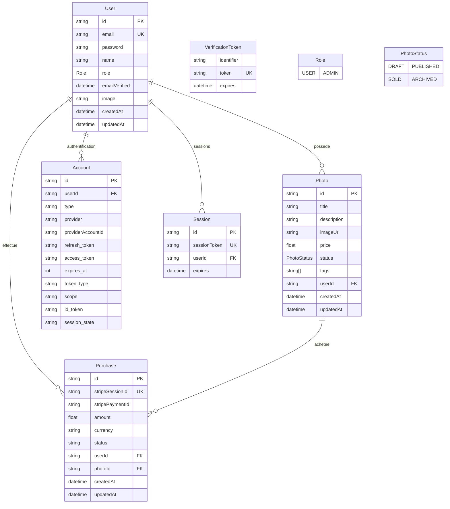
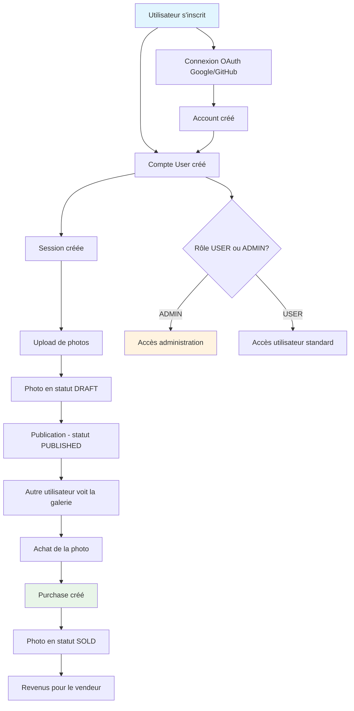
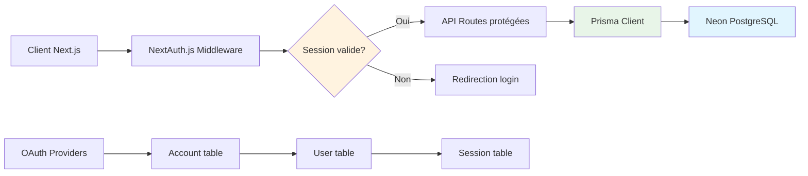

# Étape 4 : Diagramme Mermaid du schéma PhotoMarket

## Diagramme ERD complet du schéma Prisma

Le diagramme ci-dessous représente l'ensemble du schéma de base de données de l'application PhotoMarket avec toutes les relations et contraintes.



## Légende du diagramme

### Symboles et notations

| Symbole | Signification |
|---------|---------------|
| **PK** | Clé primaire (Primary Key) |
| **FK** | Clé étrangère (Foreign Key) |
| **UK** | Contrainte unique (Unique Key) |
| **\|\|--o{** | Relation un vers plusieurs (1:N) |
| **\|\|--\|\|** | Relation un vers un (1:1) |

### Types de données

| Type | Description | Exemple |
|------|-------------|---------|
| `string` | Chaîne de caractères | "alice@example.com" |
| `float` | Nombre décimal | 25.99 |
| `int` | Nombre entier | 3600 |
| `datetime` | Date et heure | 2024-01-15 14:30:00 |
| `string[]` | Tableau de chaînes | ["nature", "sunset", "beach"] |
| `Role` | Énumération | USER ou ADMIN |
| `PhotoStatus` | Énumération | DRAFT, PUBLISHED, SOLD, ARCHIVED |

### Description détaillée des champs

#### Entité User
| Champ | Type | Description |
|-------|------|-------------|
| `id` | string PK | Identifiant unique généré automatiquement |
| `email` | string UK | Adresse email (unique) |
| `password` | string | Mot de passe hashé |
| `name` | string | Nom complet de l'utilisateur |
| `role` | Role | Rôle USER ou ADMIN |
| `emailVerified` | datetime | Date de vérification de l'email |
| `image` | string | URL de l'avatar |
| `createdAt` | datetime | Date de création du compte |
| `updatedAt` | datetime | Date de dernière modification |

#### Entité Photo
| Champ | Type | Description |
|-------|------|-------------|
| `id` | string PK | Identifiant unique de la photo |
| `title` | string | Titre de la photo |
| `description` | string | Description optionnelle |
| `imageUrl` | string | URL de l'image stockée |
| `price` | float | Prix en euros |
| `status` | PhotoStatus | Statut de publication |
| `tags` | string[] | Tags pour la recherche |
| `userId` | string FK | Propriétaire de la photo |
| `createdAt` | datetime | Date d'upload |
| `updatedAt` | datetime | Date de modification |

#### Entité Purchase
| Champ | Type | Description |
|-------|------|-------------|
| `id` | string PK | Identifiant unique de l'achat |
| `stripeSessionId` | string UK | ID de session Stripe (unique) |
| `stripePaymentId` | string | ID du paiement Stripe confirmé |
| `amount` | float | Montant payé |
| `currency` | string | Devise (EUR par défaut) |
| `status` | string | pending, completed, failed |
| `userId` | string FK | Acheteur |
| `photoId` | string FK | Photo achetée |
| `createdAt` | datetime | Date de l'achat |
| `updatedAt` | datetime | Date de modification |

#### Énumérations

**Role** - Rôles des utilisateurs :
| Valeur | Description |
|--------|-------------|
| `USER` | Utilisateur standard (peut acheter et vendre des photos) |
| `ADMIN` | Administrateur (accès complet à la gestion) |

**PhotoStatus** - Statuts des photos :
| Valeur | Description |
|--------|-------------|
| `DRAFT` | Photo en brouillon (non visible publiquement) |
| `PUBLISHED` | Photo publiée (visible et achetable) |
| `SOLD` | Photo vendue (plus disponible à l'achat) |
| `ARCHIVED` | Photo archivée (retirée de la vente) |

## Relations détaillées

### 1. User → Photo (1:N)
- **Description** : Un utilisateur peut posséder plusieurs photos
- **Clé étrangère** : `Photo.userId` → `User.id`
- **Contrainte** : `onDelete: Cascade` (si user supprimé → photos supprimées)
- **Usage** : Galerie personnelle, revenus vendeur

### 2. User → Purchase (1:N)
- **Description** : Un utilisateur peut effectuer plusieurs achats
- **Clé étrangère** : `Purchase.userId` → `User.id`
- **Contrainte** : `onDelete: Cascade`
- **Usage** : Historique d'achats, statistiques acheteur

### 3. Photo → Purchase (1:N)
- **Description** : Une photo peut être achetée plusieurs fois
- **Clé étrangère** : `Purchase.photoId` → `Photo.id`
- **Contrainte** : `onDelete: Cascade`
- **Usage** : Statistiques de vente, popularité des photos

### 4. User → Account (1:N) - NextAuth.js
- **Description** : Un utilisateur peut avoir plusieurs comptes de connexion
- **Clé étrangère** : `Account.userId` → `User.id`
- **Usage** : OAuth Google, GitHub, connexion email

### 5. User → Session (1:N) - NextAuth.js
- **Description** : Un utilisateur peut avoir plusieurs sessions actives
- **Clé étrangère** : `Session.userId` → `User.id`
- **Usage** : Connexion simultanée sur plusieurs appareils

## Diagramme des flux métier



## Requêtes typiques basées sur le schéma

### 1. Dashboard vendeur
```sql
-- Revenus total d'un vendeur
SELECT 
  u.name,
  COUNT(ph.id) as total_photos,
  SUM(pu.amount) as total_revenus
FROM users u
LEFT JOIN photos ph ON ph.userId = u.id
LEFT JOIN purchases pu ON pu.photoId = ph.id
WHERE u.id = 'user-id'
GROUP BY u.id, u.name
```

### 2. Galerie publique
```sql
-- Photos disponibles à l'achat
SELECT 
  ph.id,
  ph.title,
  ph.price,
  ph.tags,
  u.name as vendor_name,
  COUNT(pu.id) as sales_count
FROM photos ph
JOIN users u ON u.id = ph.userId
LEFT JOIN purchases pu ON pu.photoId = ph.id
WHERE ph.status = 'PUBLISHED'
GROUP BY ph.id, ph.title, ph.price, ph.tags, u.name
ORDER BY ph.createdAt DESC
```

### 3. Historique d'achats
```sql
-- Achats d'un utilisateur
SELECT 
  pu.id,
  pu.amount,
  pu.createdAt,
  ph.title,
  ph.imageUrl,
  vendor.name as vendor_name
FROM purchases pu
JOIN photos ph ON ph.id = pu.photoId
JOIN users vendor ON vendor.id = ph.userId
WHERE pu.userId = 'buyer-id'
ORDER BY pu.createdAt DESC
```

## Contraintes et validations métier

### Contraintes automatiques (Prisma)
1. **Clés primaires** : Uniques et non nulles
2. **Clés étrangères** : Références valides obligatoires
3. **Contraintes uniques** : email, sessionToken, stripeSessionId
4. **Types de données** : Validation automatique

### Contraintes métier à implémenter
1. **Auto-achat interdit** : Un user ne peut pas acheter sa propre photo
2. **Photos DRAFT** : Non visibles dans la galerie publique
3. **Sessions expirées** : Nettoyage automatique
4. **Prix positifs** : Photos avec prix > 0

## Optimisations recommandées

### Index additionnels
```prisma
model Photo {
  // Index composé pour galerie
  @@index([status, createdAt])
  @@index([userId, status])
  @@index([price])
}

model Purchase {
  // Index pour historiques
  @@index([userId, createdAt])
  @@index([photoId, createdAt])
}
```

### Vues matérialisées suggérées
1. **seller_stats** : Statistiques pré-calculées par vendeur
2. **popular_photos** : Photos les plus achetées
3. **monthly_revenue** : Revenus mensuels

## Architecture de sécurité



Ce diagramme Mermaid et cette documentation complètent parfaitement l'analyse du schéma Prisma pour l'étape 4 !